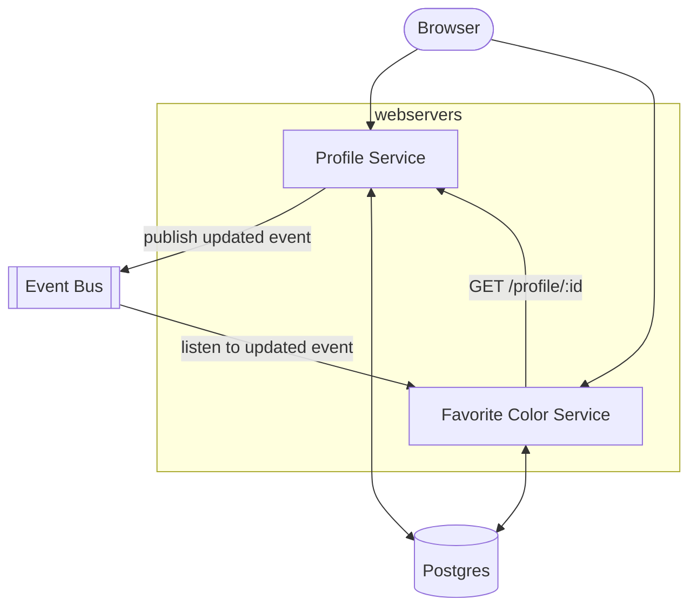

# BYU OIT AppEng Hack Day 2024
Proof of Concept application idea with Go and HTMX.

## Go, Go-Template, HTMX (GoTH) Stack
I wanted to prove out a Go stack that provides both REST APIs and HTML pages.

I also wanted to test out Kafka as an internal event bus between different apps.

## Things I liked
- Quick to start (I had a webserver up and running in less than 1 hour)
- Few dependencies
  - No external framework (webserver nor frontend)
  - No external library for HTML templates
  - Just used standard library packages for most things
  - The only dependencies I had to install were for Postrgres and Kafka
- Go language
  - Type safety
  - Explicit error handling (no errors "thrown")
  - Built-in linter (`go fmt`)
  - Decent dependency management (`go mod tidy`)
  - IDE made it super easy (auto imported, auto formatted etc.)
  - Built-in test tool (I didn't play with this during this Hack Day, but I've used it before)
  - Go feels like a good mix between low-level (flexibility) and higher modern languages (simplicity)
  - Go routines felt similar to Kotlin's coroutines, but simpler
- Felt oddly like it was too easy to get where I did with little golang background
- Simpler than I thought to connect to a database and execute queries
- Free to write code in many different ways, felt pretty good/simple to follow a hexagonal approach in this POC
- Debugger connected seamlessly

## Things I disliked
- Kafka was harder than I expected
- Trying to get 2 docker containers in same repo was harder than expected
  - after extra hours last night, I couldn't get my apps to communicate with kafka container
- Go version: I had an older version already installed and I spent too long trying to figure out how I had installed it previously (problem with the way I set up my machine)
- Trying to understand how to use inner packages or to share packages between apps
  - Monorepos don't seem like a good idea, although that may not be a relevant concern if we're moving to combine front and back ends anyway
- Not enough time
- OOP in Go was not as intuitive as I'd hoped

## Things to do
- Authentication/Authorization
- Share browser session context between apps (like the brownie)
- Unit tests
- Dive deeper into OOP in go
- Add middleware pieces to web server (logging etc.)
- Fix docker and docker-compose issues so it's easier startup for anyone new
- Investigate Go workspaces
- Flesh out more pages to test more functionality
- Flesh out HTTP client more than the simple request syntax I did
- Implement go's `log/slog` package for structured logs
- Research kafka